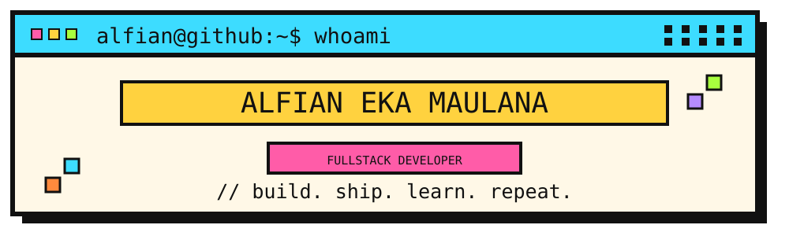
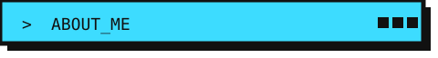
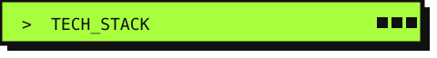
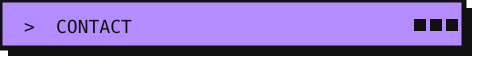

  

Fullstack developer focused on building and shipping web applications **end to end** —
from database design and backend to frontend and deployment.

I enjoy turning real problems into products that actually get used, and I'm currently
going deeper into **cloud** and **scalable architecture**. Outside of code, I've led an
editorial team and mentored students in web development.

**Languages**

**Frameworks**

**Databases**

**Practices**

**Tools**

**Web Development Mentor** — SMKN 20 Jakarta · *Internship*
`Oct 2025 – Jan 2026`

- Mentored software engineering students in Laravel web development.
- Guided end-to-end development of web applications using clean, maintainable practices.

**Head of Editorial Division** — UKM Jurnalistik
`Mar 2025 – Mar 2026`

- Led the editorial team to plan and publish content consistently.
- Coordinated cross-division collaboration to improve content strategy and reach.

**Digital Archive & Documentation** — Museum Nasional Indonesia · *Internship*
`Jul 2022 – Oct 2022`

- Organized digital archives and multimedia assets to improve accessibility.
- Maintained documentation workflows for internal and external publications.

### Paragraf Muda
`Fullstack Web` `Laravel` `MySQL`

A production news portal with an integrated organization management system — built and
deployed end to end, from database design to hosting.

### SIPARA
`Project Manager` `Laravel` `MVP`

A financial web application MVP with secure transaction handling and automated financial
reporting. Registered under national copyright protection (DJKI).

**Education**

- **Universitas Bina Sarana Informatika** — S1 Information Systems · GPA 3.87/4.00
  `2023 – 2027`

**Achievements & Certificates**

- **1st Place** — UBSI IT Bootcamp 2025 · Project Manager for SIPARA
- **Program Analyst** — BNSP Competency Assessment · Declared Competent
- **Project Management Fundamental** — Digital Talent Scholarship, KOMDIGI · 2025

Open to new projects, creative ideas, and career opportunities in tech.

