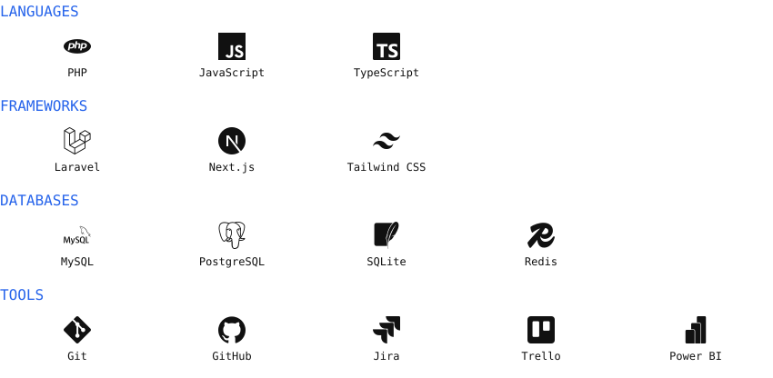

<picture>
  <source media="(prefers-color-scheme: dark)" srcset="assets/header-dark.svg">
  
</picture>

<picture>
  <source media="(prefers-color-scheme: dark)" srcset="assets/divider-dark.svg">
  
</picture>

<picture>
  <source media="(prefers-color-scheme: dark)" srcset="assets/section-about-dark.svg">
  
</picture>

Fullstack developer focused on building and shipping web applications **end to end** —
from database design and backend to frontend and deployment.

I enjoy turning real problems into products that actually get used, and I'm currently
going deeper into **cloud** and **scalable architecture**.

<picture>
  <source media="(prefers-color-scheme: dark)" srcset="assets/section-stack-dark.svg">
  
</picture>

<picture>
  <source media="(prefers-color-scheme: dark)" srcset="assets/stack-dark.svg">
  
</picture>

<picture>
  <source media="(prefers-color-scheme: dark)" srcset="assets/section-stats-dark.svg">
  
</picture>

<picture>
  <source media="(prefers-color-scheme: dark)" srcset="https://github-readme-stats.vercel.app/api?username=alfianmaulana114&show_icons=true&hide_border=true&include_all_commits=true&count_private=true&bg_color=0D1117&title_color=3B82F6&text_color=F0F6FC&icon_color=3B82F6">
  
</picture>
<picture>
  <source media="(prefers-color-scheme: dark)" srcset="https://github-readme-stats.vercel.app/api/top-langs/?username=alfianmaulana114&layout=compact&hide_border=true&langs_count=8&bg_color=0D1117&title_color=3B82F6&text_color=F0F6FC">
  
</picture>

<picture>
  <source media="(prefers-color-scheme: dark)" srcset="assets/section-contact-dark.svg">
  
</picture>

Open to new projects, creative ideas, and career opportunities in tech.

