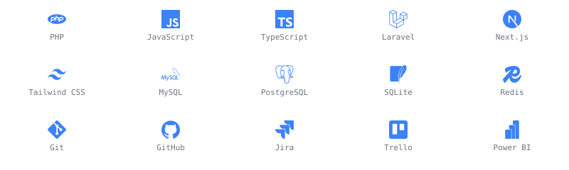

<h2>Hi, I'm Alfian </h2>


<p></p>



Fullstack developer based in Jakarta, Indonesia. I build and ship web
applications **end to end** — database design, backend, frontend, and deployment.

I'm an Information Systems student at Universitas Bina Sarana Informatika, and
I'm currently going deeper into **cloud** and **scalable architecture**. Outside
of code, I've led an editorial team and mentored students in web development.

### A little more about me...

```typescript
const alfian = {
  role: "Fullstack Developer",
  location: "Jakarta, Indonesia",
  education: "S1 Information Systems — Universitas Bina Sarana Informatika",
  code: ["TypeScript", "PHP", "JavaScript"],
  frameworks: ["Laravel", "Next.js", "Tailwind CSS"],
  databases: ["MySQL", "PostgreSQL", "SQLite", "Redis"],
  cloud: ["Google Cloud Platform"],
  tools: ["Git", "GitHub", "Jira", "Trello", "Power BI"],
  currentlyLearning: "scalable architecture & cloud-native apps",
};
```

### Tech stack



### GitHub stats

<p align="center">
  
  
</p>

<p align="center">
  
</p>

### Let's connect

I'm always open to new projects, creative ideas, and career opportunities in tech.

[](https://alfianmaulana.me)
[](https://www.linkedin.com/in/alfianekamaulana)
[](https://github.com/alfianmaulana114)
[](mailto:alfianmaulana114@gmail.com)

<details>
<summary>ASCII art</summary>

```
  ###  #     ##### #####  ###  #   #
 #   # #     #       #   #   # ##  #
 ##### #     ####    #   ##### # # #
 #   # #     #       #   #   # #  ##
 #   # ##### #     ##### #   # #   #
```

</details>

<details>
<summary>Credits</summary>

- Display fonts: **Press Start 2P** and **VT323**, licensed under the [SIL Open Font License 1.1](tools/fonts/) — full licence texts are in `tools/fonts/`.
- Icons: [Simple Icons](https://simpleicons.org/) (CC0 1.0).
- Stats cards: [github-readme-stats](https://github.com/anuraghazra/github-readme-stats) and [github-readme-streak-stats](https://github.com/DenverCoder1/github-readme-streak-stats) (MIT).
- All artwork in `assets/` is generated by [`tools/generate_assets.py`](tools/generate_assets.py).

</details>
